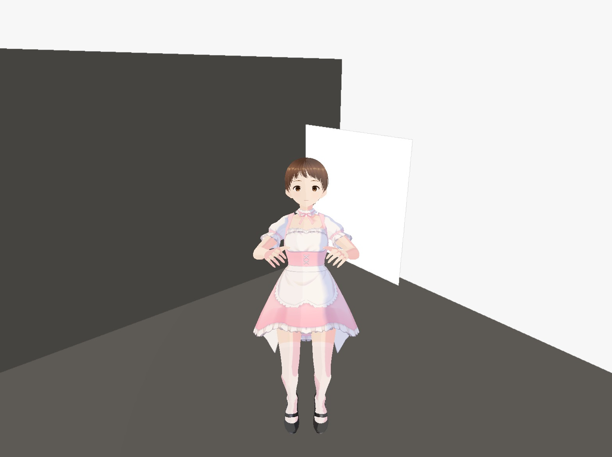

# 🏆 AISIGNAR
## AI-Powered Speech and Text to Sign Language Translation using a 3D Avatar in Unity

<p align="center">


</p>

---

# 📖 Project Overview

AISIGNAR (AI Sign AR) is an AI-powered Augmented Reality communication system developed to bridge the communication gap between hearing-impaired individuals and people unfamiliar with sign language.

The application converts speech and typed text into sign language using Artificial Intelligence (AI), Natural Language Processing (NLP), and a realistic 3D avatar developed in Unity.

Instead of relying on prerecorded sign-language videos, AISIGNAR dynamically generates sign-language animations through a virtual avatar, providing a scalable, interactive, and accessible communication solution.

---

# 🎯 Objectives

- Convert speech into text using AI.
- Process both speech and typed text.
- Apply NLP to understand user input.
- Translate processed language into sign-language gestures.
- Display gestures through a 3D animated avatar.
- Improve accessibility for hearing-impaired users.
- Demonstrate AI and AR integration in a real-world application.

---

# ✨ Key Features

- 🎤 Speech-to-Text Conversion
- ⌨️ Text Input Support
- 🤖 Natural Language Processing (NLP)
- 🧠 AI-Based Sign Mapping
- 🥽 Augmented Reality Integration
- 🧍 Interactive 3D Avatar
- 🎞️ Real-Time Sign Language Animation
- 🎨 User-Friendly Interface
- ⚡ Fast Processing
- ♿ Accessibility-Focused Design

---

# 🛠 Technologies Used

## Programming Languages

- C#
- Python

## AI & Machine Learning

- Artificial Intelligence (AI)
- Natural Language Processing (NLP)
- PyTorch
- MediaPipe

## XR Development

- Unity 3D
- Augmented Reality (AR)
- Virtual Reality (VR)
- Extended Reality (XR)
- OpenXR
- Vuforia

## 3D Design

- Blender
- Ready Player Me
- Mixamo Animations

## Backend

- Flask API
- Whisper Speech Recognition

## Testing

- AR Application Testing
- VR Application Testing
- Manual Testing
- Functional Testing
- UI Testing
- Bug Reporting

---

# 🏗 System Architecture

```text
Speech Input / Text Input
           │
           ▼
Speech Recognition (Whisper)
           │
           ▼
Natural Language Processing (NLP)
           │
           ▼
AI Sign Language Mapping
           │
           ▼
Unity Animation Controller
           │
           ▼
3D Avatar
           │
           ▼
Augmented Reality Output
```

---

# 🔄 Workflow

```text
Speech Input
      │
      ▼
Speech Recognition
      │
      ▼
Text Processing
      │
      ▼
Natural Language Processing
      │
      ▼
Sign Mapping
      │
      ▼
Unity Animation
      │
      ▼
3D Avatar
      │
      ▼
AR Output
```

---

# 📸 Project Screenshots

## Home Screen


---

## Application Interface

(

---

## Demo Video

[▶ Watch Demo](Videos/AISIGNAR_Demo.mp4)

## Project Report

[📄 Project Report](Documents/Project_Report.pdf)

---

# 🎓 Internship

## AR/VR Test Engineer

**Organization:** IIT Hyderabad

During my internship, I gained hands-on experience in:

- AR Application Testing
- VR Application Testing
- Functional Testing
- UI Testing
- User Experience Testing
- Bug Reporting
- Unity Testing
- AI + AR Application Development

The internship provided practical exposure to immersive technologies, AI integration, and XR application testing.

---

# 👨‍💻 My Contributions

- Developed the Unity-based user interface.
- Designed the speech and text interaction workflow.
- Integrated AI and NLP concepts into the project architecture.
- Implemented avatar-based sign language communication.
- Performed AR and VR application testing.
- Conducted manual and functional testing.
- Debugged application workflows.
- Prepared project documentation and demonstrations.

---

# 🚀 Future Enhancements

- Indian Sign Language Dataset Expansion
- Real-Time AI Translation
- Multi-Language Support
- Meta Quest Deployment
- Cloud-Based AI Processing
- Gesture Recognition using Computer Vision
- Mobile AR Application
- Improved NLP Model
- Finger-Level Animation Tracking

---

# 📚 References

- Unity Documentation
- OpenAI Whisper Documentation
- Flask Documentation
- MediaPipe Documentation
- PyTorch Documentation
- Mixamo Animation Library
- Ready Player Me Documentation
- OpenXR Documentation

---

# 🏅 Skills Demonstrated

- Artificial Intelligence
- Natural Language Processing
- Unity Development
- Augmented Reality
- Virtual Reality
- XR Development
- Avatar Animation
- AI Integration
- Functional Testing
- Manual Testing
- UI Testing
- Problem Solving
- Team Collaboration

---

# 📂 Repository Structure

```
AI-AR-Sign-Language-System

├── README.md

├── Documents
│      Project_Report.pdf
│      Internship_Certificate.jpg
│      Internship_Result.pdf

├── Images
│      Home_Screen.jpg

├── Videos
│      AISIGNAR_Demo.mp4

├── Diagrams

├── Assets
```

---

# 🙏 Acknowledgements

Special thanks to the mentors and faculty members of IIT Hyderabad for providing guidance, technical support, and an excellent learning environment throughout the internship.

---

# 📬 Contact

**G. Chandan Lal**

📧 Email: *(Add your email here)*

💼 LinkedIn: *(Add your LinkedIn URL)*

🐙 GitHub: *(Add your GitHub profile URL)*

---

## ⭐ If you found this project interesting, consider giving it a star!